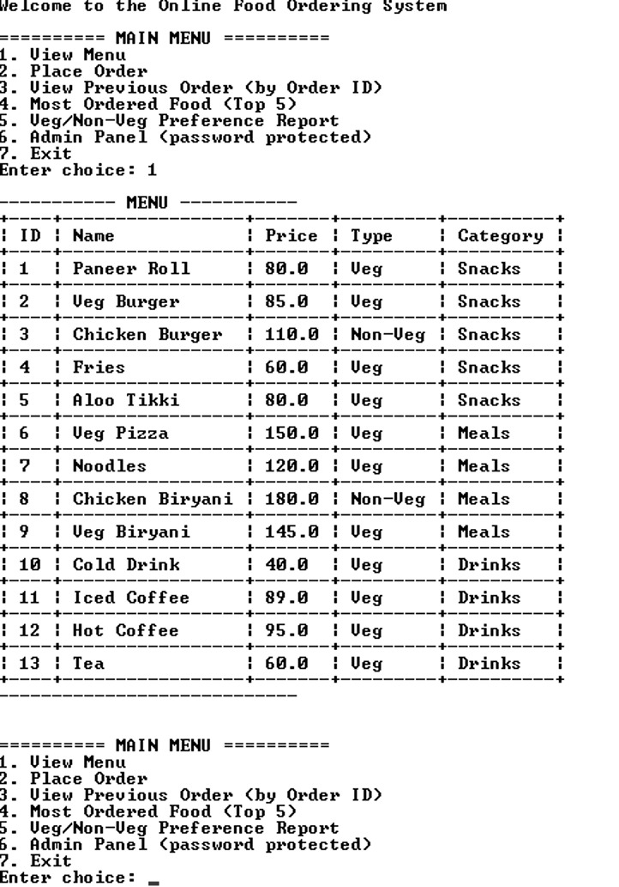
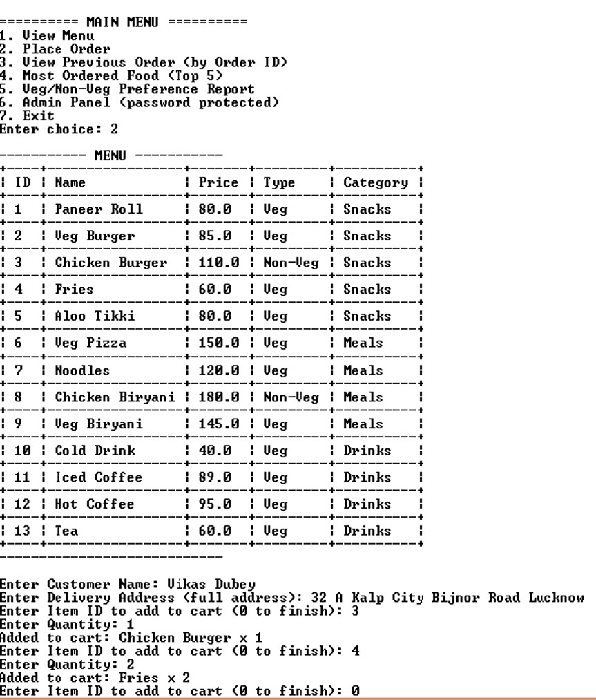
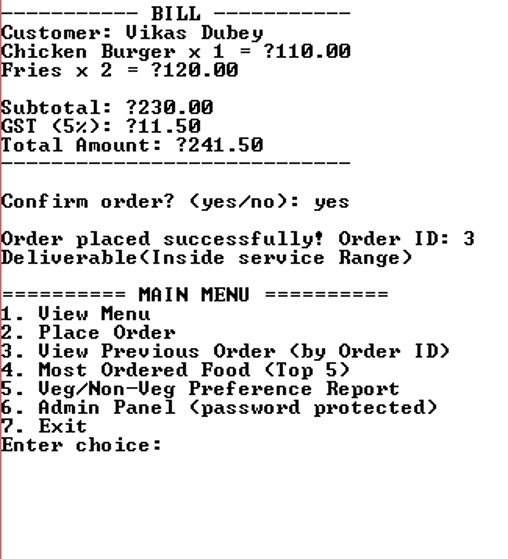
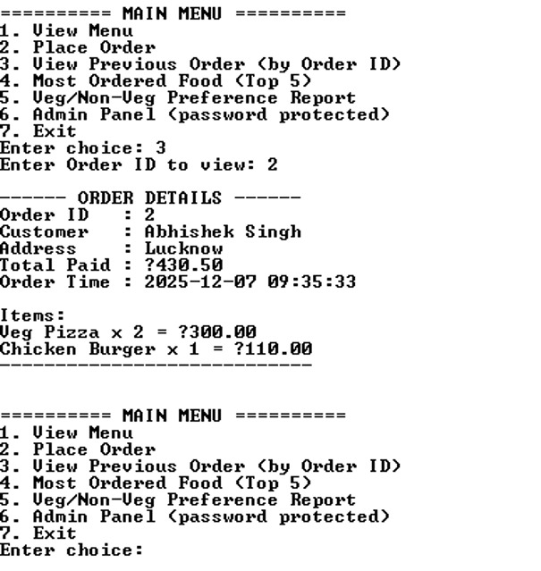
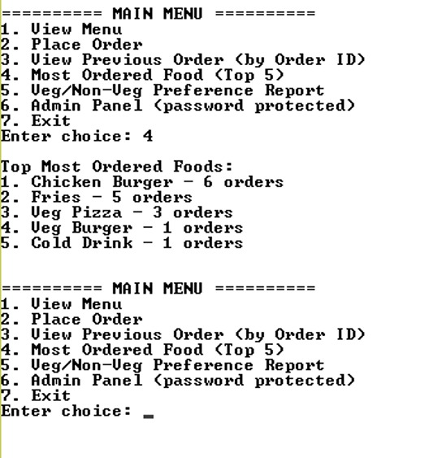
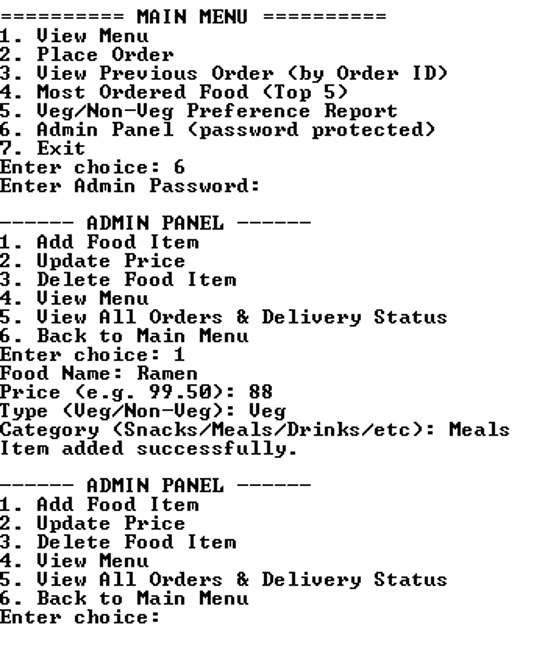
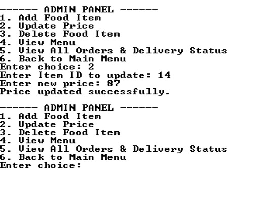
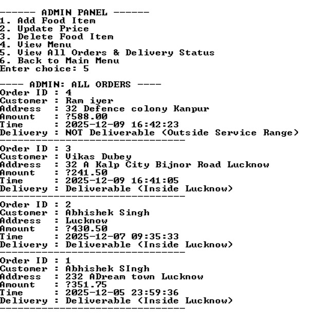
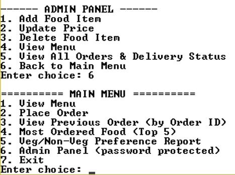

\# Food Ordering System

A console-based Food Ordering System developed using Python and MySQL.

This project allows customers to browse food items, place orders, view previous orders, and generate reports. It also includes an admin panel for menu management and order monitoring.

\## Features

\* View food menu

\* Place food orders

\* View previous orders using Order ID

\* Top 5 most ordered food report

\* Veg/Non-Veg preference report

\* Admin panel with password protection

\* Add food items

\* Update food prices

\* Delete food items

\* View all orders and delivery status

\* MySQL database integration

\## Technologies Used

\* Python

\* MySQL

\* mysql-connector-python

\## Project Structure

food-ordering-system/

├── Food\_ordering\_system.py

├── database\_schema.sql

├── requirements.txt

├── README.md

└── screenshots/

\## Installation

1\. Install Python.

2\. Install MySQL Server.

3\. Install required package:

pip install mysql-connector-python

4\. Execute database\_schema.sql in MySQL Workbench.

5\. Update database credentials in Food\_ordering\_system.py.

6\. Run:

python Food\_ordering\_system.py

\## Screenshots

\### Food Menu

\### Place Order

\### Order Confirmation

\### Previous Order Lookup

\### Top Ordered Foods

\### Veg/Non-Veg Preference Report

\### Admin Panel

\### Update Price

\### Delete Food Item

\### All Orders Report

\### Exit Screen 

\## Author

Abhishek Singh

GitHub:

https://github.com/abhishekchauhan08082008

